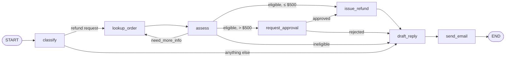

# Support agent service

A small HTTP service that handles customer support tickets for an online store. Each ticket goes
through a [LangGraph](https://docs.langchain.com/oss/python/langgraph/overview) workflow that decides
whether it is a refund request, checks the order against the return policy, issues the refund (with a
manager's approval above $500) and emails the customer.

## Workflow



| node | what it does |
|------|--------------|
| `classify` | LLM decides `refund_request` or `not_refund` |
| `lookup_order` | `GET /orders/{order_id}` on the store backend |
| `assess` | LLM applies the return policy: `eligible`, `ineligible` or `need_more_info` (look the order up again) |
| `request_approval` | pauses the run (`interrupt`) until a manager approves or rejects via the API |
| `issue_refund` | `POST /refunds` on the store backend |
| `draft_reply` | LLM writes the customer email |
| `send_email` | `POST /emails` on the store backend |

Return policy: 30 days from delivery, no refunds on final-sale items, refunds over $500 need approval.

LLM prompts carry the ticket context as one-line JSON after `TASK:`, `TICKET:`, `ORDER:` and
`DECISION:` markers (see `app/llm.py`). Every LLM request sends `X-Ticket-Id` and `X-Run-Id` headers.

## API

| method & path | description |
|---------------|-------------|
| `POST /runs` | body `{ticket_id, customer_id, order_id, email, message}`. Runs the workflow and returns the run record once it has completed, failed, or paused for approval. |
| `GET /runs/{run_id}` | the run record |
| `GET /runs?ticket_id=…&status=…` | `{"runs": [...]}`, both filters optional |
| `POST /runs/{run_id}/approve` | body `{approved: bool, approver: str}`. Resumes a run in `awaiting_approval`. Returns the record unchanged if the run has already finished, 409 if it is still running. |
| `GET /healthz` | `{"ok": true}` |

Run record:

```json
{
  "run_id": "…", "ticket_id": "T-00001", "customer_id": "cust-01",
  "status": "running | awaiting_approval | completed | failed",
  "created_at": 1760000000.0, "finished_at": 1760000003.2, "error": null,
  "result": {"outcome": "refunded", "refund_id": "rf_…", "email_id": "em_…", "…": "…"},
  "steps": 6
}
```

While a run waits for approval, `result` is `{"approval_request": {"type": "approval", "ticket_id", "order_id", "amount"}}`.
`steps` counts executed workflow nodes.

Runs and LangGraph checkpoints are kept in process memory (`InMemorySaver`).

## Configuration

| env var | default |
|---------|---------|
| `LLM_BASE_URL` | `http://mock-llm:8100/v1` |
| `LLM_MODEL` | `mock-large` |
| `COMMERCE_URL` | `http://commerce:8200` |

Timeouts, retry counts and the approval threshold are in `app/config.py`.

## Running

With Docker Compose from the assignment folder the service runs as `api` on port 8000.

Locally (needs [uv](https://docs.astral.sh/uv/); the LLM and store backend must be reachable):

```bash
cd agent
LLM_BASE_URL=http://localhost:8100/v1 COMMERCE_URL=http://localhost:8200 \
  uv run --no-project --python 3.12 --with-requirements requirements.txt \
  uvicorn app.server:app --port 8000
```

```bash
curl -s localhost:8000/runs -H 'Content-Type: application/json' -d '{
  "ticket_id": "T-00001", "customer_id": "cust-01", "order_id": "O-00001",
  "email": "cust-01@example.com", "message": "My order arrived damaged, can I get a refund?"}'
```

## Tests

The tests replace the LLM and store backend with in-process fakes (`tests/fakes.py`), so nothing else
needs to be running:

```bash
cd agent
uv run --no-project --python 3.12 --with-requirements requirements-dev.txt pytest
```
